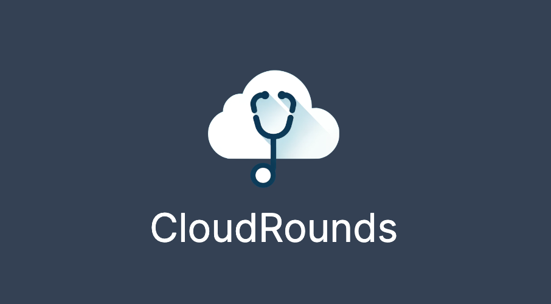

  

CloudRounds is a comprehensive solution designed to assist medical learners, researchers, health professionals, coordinators, and other stakeholders in managing, viewing, and accessing educational events such as medical rounds, research meetings, webinars, seminars, and more in a more intuitive manner. 

## Features

### Permissions-Role-Based System

- CloudRounds offers a robust permissions-role-based system. Users can create calendars for various purposes and provide View or Write permissions to other users.
- Additionally, users can invite others via email to access specific calendars or events.
- The integrated calendar also comes with a feature to send email notifications about upcoming events, ensuring you never miss an important round or event.
- Permissions or organizations can choose to feature their calendar in a public catalog, thus engaging a wider audience of learners 

### User Authentication
Secure login and signup functionality to ensure only authorized users can access the platform.

### Admin Dashboard
Provides administrators with the ability to manage user permissions and oversee platform activities.

### Article Management
Allows users to view, create, and manage articles related to seminars, rounds, and events.

### Events Catalog
Organizers can opt to have their calendar featured in a public catalog that users can request access to, potentially increasing their audience and reach. 

### Integrated feedback forms
Provides speakers and event organizers with easy to use, customizable feedback forms built directly into the app that can be shared with event attendees.

